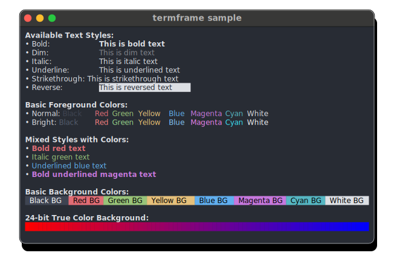

# 📸 termframe [![Build Status][ci-img]][ci] [![Release][release-img]][release]

Terminal output SVG screenshot tool.

This tool is a non-interactive terminal emulator that executes a single command, renders its output in an internal virtual session, and exports a screenshot as an SVG file.

## Sample

<p align="center">
    <picture>
    <source media="(prefers-color-scheme: dark)" srcset="doc/sample-dark.svg" />
    <source media="(prefers-color-scheme: light)" srcset="doc/sample-light.svg" />
    
    </picture>
</p>

## Installation

### macOS

* Install using [homebrew](https://brew.sh) on macOS

  ```sh
  brew install pamburus/tap/termframe
  ```

### Linux

* Download and extract using `curl` and `tar` on Linux (x86_64)

    ```sh
    curl -sSfL -o /usr/local/bin/termframe https://github.com/pamburus/termframe/releases/latest/download/termframe-linux-x86_64-musl.tar.gz | tar xz
    ```

* Install using [cargo](https://www.rust-lang.org/tools/install)

    ```sh
    cargo install --locked --git https://github.com/pamburus/termframe.git
    ```

### Windows

* Install using [scoop](https://scoop.sh)

    ```sh
    scoop bucket add pamburus https://github.com/pamburus/scoop-bucket.git
    scoop install termframe
    ```

* Download latest release from [download page](https://github.com/pamburus/termframe/releases/latest)

## Usage

* Run a command and save the output to an SVG file

    ```sh
    termframe -o hello.svg -- echo "Hello, World"
    ```

* Redirect output of a command to termframe

    ```sh
    echo "Hello, World" | termframe -o hello.svg
    ```

## Configuration

### Configuration files

* Configuration files are automatically loaded if found in predefined platform-specific locations.

    | OS      | System-Wide Location                     | User Profile Location                                          |
    | ------- | ---------------------------------------- |  ------------------------------------------------------- |
    | macOS   | /etc/termframe/config.{yaml,toml,json}          | ~/.config/termframe/config.{yaml,toml,json}                     |
    | Linux   | /etc/termframe/config.{yaml,toml,json}          | ~/.config/termframe/config.{yaml,toml,json}                     |
    | Windows | %PROGRAMDATA%\termframe\config.{yaml,toml,json} | %USERPROFILE%\AppData\Roaming\termframe\config.{yaml,toml,json} |

* The path to the configuration file can be overridden using the `TERMFRAME_CONFIG` environment variable or the `--config` command-line option.

  The order in which the configuration files are searched and loaded is as follows:
  * The system-wide location.
  * The user profile location.
  * The location specified by the `TERMFRAME_CONFIG` environment variable (unless the `--config` option is used).
  * The locations specified by the `--config` option (can be specified multiple times).

  If a configuration file is found in multiple locations, the file in each subsequent location overrides only the parameters it contains.

  If `TERMFRAME_CONFIG` or `--config` specifies `-` or an empty string, all default locations and any locations specified by previous `--config` options are discarded. The search for the configuration file locations starts over.

  To disable loading of configuration files and use the built-in defaults, `--config -` can be used.

* All parameters in the configuration file are optional and can be omitted. In such cases, default values will be used.

#### Default configuration file

* [config.toml](assets/config.toml)

### Environment variables

* Many parameters that are defined in command-line arguments and configuration files can also be specified by environment variables.

#### Precedence of configuration sources (from lowest priority to highest priority)

* Configuration file
* Environment variables
* Command-line arguments

## Complete set of options and flags

```text
Terminal output SVG screenshot tool

Usage: termframe [OPTIONS] [COMMAND] [ARGS]...

Arguments:
  [COMMAND]  Command to run
  [ARGS]...  Arguments provided to the command

Options:
      --config <FILE>               Configuration file path [env: TERMFRAME_CONFIG=]
  -W, --width <COLUMNS>             Width of the virtual terminal window [default: 80]
  -H, --height <LINES>              Height of the virtual terminal window [default: 24]
      --padding <EM>                Override padding for the inner text in font size units
      --font-family <NAME>...       Font family, multiple comma separated values can be provided
      --font-size <SIZE>            Font size [default: 12]
      --font-weight <WEIGHT>        Normal font weight [default: normal]
      --embed-fonts <ENABLED>       Embed fonts, if possible [note: make sure the font license allows this type of redistribution] [default: false] [possible values: true, false]
      --subset-fonts <ENABLED>      Subset fonts by removing unused characters [experimental, known to have compatibility issues] [default: false] [possible values: true, false]
      --bold-is-bright <ENABLED>    Use bright colors for bold text [default: false] [possible values: true, false]
      --bold-font-weight <WEIGHT>   Bold text font weight [default: bold]
      --faint-opacity <0..1>        Faint text opacity [default: 0.5]
      --faint-font-weight <WEIGHT>  Faint text font weight [default: normal]
      --line-height <FACTOR>        Line height, factor of the font size [default: 1.2]
      --mode <MODE>                 Override dark or light mode [default: auto] [possible values: auto, dark, light]
      --theme <THEME>               Color theme
      --window <ENABLED>            Enable window [default: true] [possible values: true, false]
      --window-shadow <ENABLED>     Enable window shadow [default: true] [possible values: true, false]
      --window-margin <PIXELS>      Override window margin, in pixels
      --window-style <NAME>         Window style
      --title <TITLE>               Window title
  -o, --output <FILE>               Output file, by default prints to stdout [default: -]
      --timeout <SECONDS>           Timeout for the command to run, in seconds [default: 5]
      --list-themes[=<TAGS>]        Print available themes optionally filtered by tags [possible values: dark, light]
      --list-window-styles          Print available window styles and exit
      --list-fonts                  Print configured fonts and exit, any font not listed here cannot be embedded and may not be properly rendered
      --help                        Print help and exit
      --shell-completions <SHELL>   Print shell auto-completion script and exit [possible values: bash, elvish, fish, powershell, zsh]
      --man-page                    Print man page and exit
  -V, --version                     Print version
```

[ci-img]: https://github.com/pamburus/termframe/actions/workflows/ci.yml/badge.svg
[ci]: https://github.com/pamburus/termframe/actions/workflows/ci.yml
[release-img]: https://img.shields.io/github/v/release/pamburus/termframe?sort=semver
[release]: https://github.com/pamburus/termframe/releases/latest
