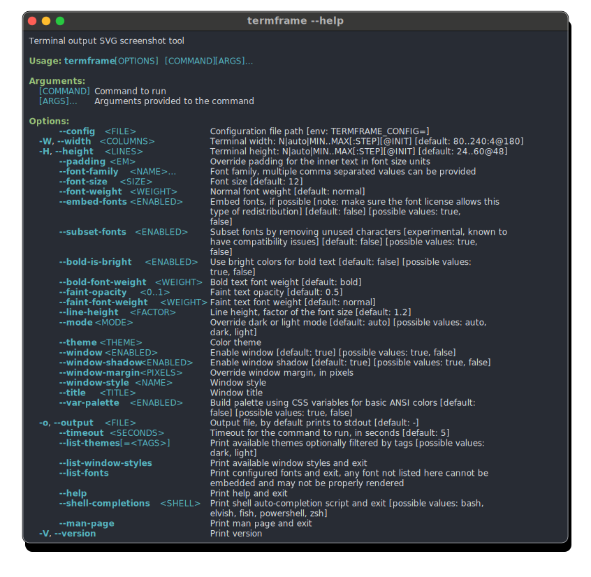

# 📸 termframe [![Build Status][ci-img]][ci] [![Coverage Status][cov-img]][cov] [![Release][release-img]][release]

Terminal output SVG screenshot tool.

This tool is a non-interactive terminal emulator that executes a single command, renders its output in an internal virtual session, and exports a screenshot as an SVG file.

## Key features

* Comprehensive ANSI style support:
  * Bold, dimmed (faint), italic, underlined, and strikethrough text.
  * Text with reversed background/foreground colors.
  * Full range of colors: basic 16 palette, 256 xterm palette, and 24-bit truecolor.
* Optional font embedding for enhanced customization.
* Dark and light mode compatibility.
* Extensive theme collection from [iTerm2-Color-Schemes](https://github.com/mbadolato/iTerm2-Color-Schemes).
* Support for custom themes, refer to [custom themes](#custom-themes).
* Flexible configuration system, see [configuration files](#configuration-files).
* Customizable [window styles](assets/window-styles/macos.toml), see [custom window styles](#custom-window-styles).

## Sample

<p align="center">
    <picture>
    <source media="(prefers-color-scheme: dark)" srcset="doc/sample-dark.svg" />
    <source media="(prefers-color-scheme: light)" srcset="doc/sample-light.svg" />
    
    </picture>
</p>

PNG images: [sample-dark.png](https://github.com/user-attachments/assets/5fe3fcf6-446a-49cf-a447-0120a04bd8f3) and [sample-light.png](https://github.com/user-attachments/assets/85b080b0-59b4-45ae-9ba2-7eebe0d4d09c)

## Installation

### macOS

* Install using [homebrew](https://brew.sh) on macOS

  ```sh
  brew install pamburus/tap/termframe
  ```

### Linux

* Download and extract using `curl` and `tar` on Linux (x86_64)

    ```sh
    curl -sSfL -o /usr/local/bin/termframe https://github.com/pamburus/termframe/releases/latest/download/termframe-linux-x86_64-musl.tar.gz | tar xz
    ```

* Download and extract using `curl` and `tar` on Linux (arm64)

    ```sh
    curl -sSfL -o /usr/local/bin/termframe https://github.com/pamburus/termframe/releases/latest/download/termframe-linux-arm64-musl.tar.gz | tar xz
    ```

* Install using [cargo](https://www.rust-lang.org/tools/install)

    ```sh
    cargo install --locked --git https://github.com/pamburus/termframe.git
    ```

### Windows

* Install using [scoop](https://scoop.sh)

    ```sh
    scoop bucket add pamburus https://github.com/pamburus/scoop-bucket.git
    scoop install termframe
    ```

* Download latest release from [download page](https://github.com/pamburus/termframe/releases/latest)

## Usage

* Run a command and save the output to an SVG file

    ```sh
    termframe -o hello.svg -- echo "Hello, World"
    ```

* Redirect output of a command to termframe

    ```sh
    echo "Hello, World" | termframe -o hello.svg
    ```

* Use auto-sizing to determine optimal dimensions based on command output

    ```sh
    termframe --width auto --height auto -o output.svg -- command
    ```

* Constrain dimensions with ranges while allowing auto-sizing

    ```sh
    # Width between 80-120 columns, height auto-detected
    termframe --width 80..120 --height auto -o output.svg -- command
    
    # Width with range constraints (CLI range syntax)
    termframe --width 80..200 -o output.svg -- command
    
    # Note: JSON format with default values is only supported in configuration files
    # CLI supports: auto, fixed numbers (80), and ranges (80..120)
    ```

### Dimension Configuration

Terminal dimensions (width and height) support flexible configuration formats:

* **Fixed size**: `--width 80` - Use exactly 80 columns
* **Auto-sizing**: `--width auto` - Automatically detect optimal width from command output
* **Range constraints**: `--width 80..120` - Auto-detect width within 80-120 column range

**Note**: Advanced features like `step` and `default` values are only available in configuration files using TOML/JSON format. CLI supports `auto`, fixed numbers, and simple ranges.

**Configuration File Features**: The `default` value (available in config files) serves as:
- Initial size when no CLI override is provided
- Fallback when auto-detection fails or produces unreasonable results  
- Preferred size that gets clamped to min/max constraints if specified

## Configuration

### Configuration files

* Configuration files are automatically loaded if found in predefined platform-specific locations.

    | OS      | System-Wide Location                     | User Profile Location                                          |
    | ------- | ---------------------------------------- |  ------------------------------------------------------- |
    | macOS   | /etc/termframe/config.{yaml,toml,json}          | ~/.config/termframe/config.{yaml,toml,json}                     |
    | Linux   | /etc/termframe/config.{yaml,toml,json}          | ~/.config/termframe/config.{yaml,toml,json}                     |
    | Windows | %PROGRAMDATA%\termframe\config.{yaml,toml,json} | %USERPROFILE%\AppData\Roaming\termframe\config.{yaml,toml,json} |

* The path to the configuration file can be overridden using the `TERMFRAME_CONFIG` environment variable or the `--config` command-line option.

  The order in which the configuration files are searched and loaded is as follows:
  * The system-wide location.
  * The user profile location.
  * The location specified by the `TERMFRAME_CONFIG` environment variable (unless the `--config` option is used).
  * The locations specified by the `--config` option (can be specified multiple times).

  If a configuration file is found in multiple locations, the file in each subsequent location overrides only the parameters it contains.

  If `TERMFRAME_CONFIG` or `--config` specifies `-` or an empty string, all default locations and any locations specified by previous `--config` options are discarded. The search for the configuration file locations starts over.

  To disable loading of configuration files and use the built-in defaults, `--config -` can be used.

* All parameters in the configuration file are optional and can be omitted. In such cases, default values will be used.

#### Default configuration file

* [config.toml](assets/config.toml)

#### Terminal Configuration

The `[terminal]` section supports flexible dimension configuration with auto-sizing capabilities:

```toml
[terminal]
# Simple fixed dimensions
width = 80
height = 24

# Auto-detection
width = "auto"
height = "auto"

# Range constraints with auto-detection
width = { min = 80, max = 200 }
height = { min = 24, max = 60 }

# Step alignment (round to nearest multiple)
width = { min = 80, max = 200, step = 10 }

# Default values (preferred size with fallback to auto-detection)
width = { default = 120 }
height = { default = 30 }

# Full specification with all options
width = { min = 80, max = 240, step = 4, default = 180 }
height = { min = 24, max = 60, default = 48 }
```

The `default` value in dimension configuration:
- Serves as the initial/preferred size when no CLI override is provided
- Acts as a fallback when auto-detection fails or produces unreasonable results
- Gets clamped to `min`/`max` constraints if they are also specified
- Enables consistent sizing across different commands and environments

### Custom Themes

You can create custom themes by placing theme files in the `themes` subfolder of your configuration directory.

#### Theme file locations

Create a `themes` folder in your configuration directory:

| OS      | Theme Directory Location                                          |
| ------- | ----------------------------------------------------------------- |
| macOS   | `~/.config/termframe/themes/`                                     |
| Linux   | `~/.config/termframe/themes/`                                     |
| Windows | `%USERPROFILE%\AppData\Roaming\termframe\themes\`               |

#### Theme file formats

Theme files can be in TOML, YAML, or JSON format. Use the appropriate file extension (`.toml`, `.yaml`, `.yml`, or `.json`).

#### Theme examples

* **Dual mode theme** (supports both dark and light modes): [`assets/themes/One Double.toml`](assets/themes/One%20Double.toml)
* **Single mode theme** (dark mode only): [`assets/themes/One Double Dark.toml`](assets/themes/One%20Double%20Dark.toml)

### Custom Window Styles

You can create custom window styles by placing window style files in the `window-styles` subfolder of your configuration directory.

#### Window style file locations

Create a `window-styles` folder in your configuration directory:

| OS      | Window Styles Directory Location                                  |
| ------- | ----------------------------------------------------------------- |
| macOS   | `~/.config/termframe/window-styles/`                              |
| Linux   | `~/.config/termframe/window-styles/`                              |
| Windows | `%USERPROFILE%\AppData\Roaming\termframe\window-styles\`         |

#### Window style file formats

Window style files can be in TOML, YAML, or JSON format. Use the appropriate file extension (`.toml`, `.yaml`, `.yml`, or `.json`).

#### Window style examples

* **macOS style**: [`assets/window-styles/macos.toml`](assets/window-styles/macos.toml)
* **Compact style**: [`assets/window-styles/compact.toml`](assets/window-styles/compact.toml)

### Environment variables

* Many parameters that are defined in command-line arguments and configuration files can also be specified by environment variables.

#### Precedence of configuration sources (from lowest priority to highest priority)

* Configuration file
* Environment variables
* Command-line arguments

## Complete set of options and flags

<p align="center">
    <picture>
    <source media="(prefers-color-scheme: dark)" srcset="doc/help-dark.svg" />
    <source media="(prefers-color-scheme: light)" srcset="doc/help-light.svg" />
    
    </picture>
</p>

[ci-img]: https://github.com/pamburus/termframe/actions/workflows/ci.yml/badge.svg
[ci]: https://github.com/pamburus/termframe/actions/workflows/ci.yml
[cov-img]: https://codecov.io/gh/pamburus/termframe/graph/badge.svg?token=HI21W7NJEE
[cov]: https://codecov.io/gh/pamburus/termframe
[release-img]: https://img.shields.io/github/v/release/pamburus/termframe?sort=semver
[release]: https://github.com/pamburus/termframe/releases/latest
